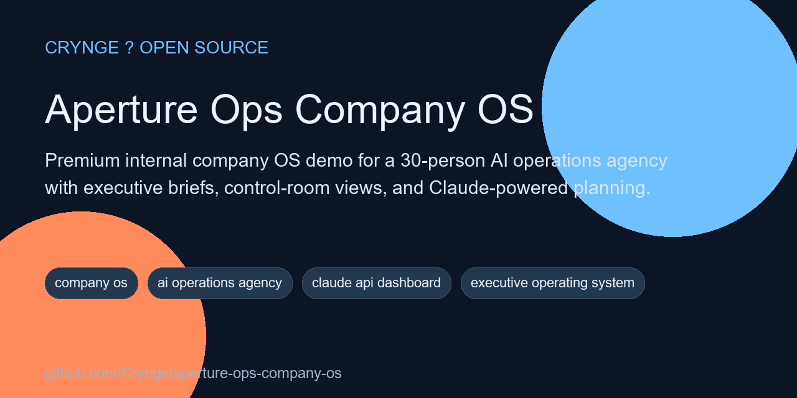

# Aperture Ops Company OS

<!-- portfolio-seo:start -->
  



> Premium internal company OS demo for a 30-person AI operations agency with executive briefs, control-room views, and Claude-powered planning.

**GitHub Search Keywords:** company os, ai operations agency, claude api dashboard, executive operating system, internal tools, nextjs agent swarm, operations control room

<!-- portfolio-seo:end -->

<!-- portfolio-links:start -->
<div align="center">

[Documentation](docs) &middot; [Authors](AUTHORS.md) &middot; [Contributing](CONTRIBUTING.md) &middot; [Security](SECURITY.md) &middot; [Workflows](.github/workflows)

</div>
<!-- portfolio-links:end -->

A premium internal company operating system demo for a **30-person AI operations agency**. This repo combines a cinematic Next.js interface with seeded executive scenarios, persistent run history, and Claude-ready orchestration patterns for leadership planning, staffing pressure, margin control, support risk, and cross-functional decision briefs.

## What It Is

Aperture Ops is positioned like an executive office with software attached: one control room where revenue, delivery, finance, people, support, and growth signals can be reviewed as a single operating brief instead of six disconnected dashboards.

## Core Product Surfaces

- Executive landing page that explains the company OS concept fast
- Control room for scenario runs and seeded operating briefs
- Prisma + SQLite persistence for scenarios, runs, and profile data
- Claude API-ready orchestration path with deterministic fallback patterns
- Premium annual-report visual treatment instead of generic SaaS chrome

## Stack

- Next.js 15
- React 19
- TypeScript
- Prisma 7 + SQLite
- Anthropic SDK
- Tailwind CSS 4

## Quick Start

```bash
npm install
npm run db:setup
npm run dev
```

Then open `http://localhost:3000`.

## Architecture

- `src/app/` - pages, route handlers, and control-room surfaces
- `src/components/` - landing page, run trace, and operator UI
- `src/lib/demo-data.ts` - seeded company profile and operating scenarios
- `src/lib/swarm/` - orchestration, fallbacks, and prompt scaffolding
- `prisma/` - schema and seeding logic

## Positioning

This repository is best understood as a **company operations demo product** rather than a generic agent swarm. The strongest use cases are:

- quarterly planning resets
- staffing and utilization pressure reviews
- margin and cash discipline decisions
- support escalation triage
- executive operating brief generation

## Verification

```bash
npm run lint
npm run build
```
